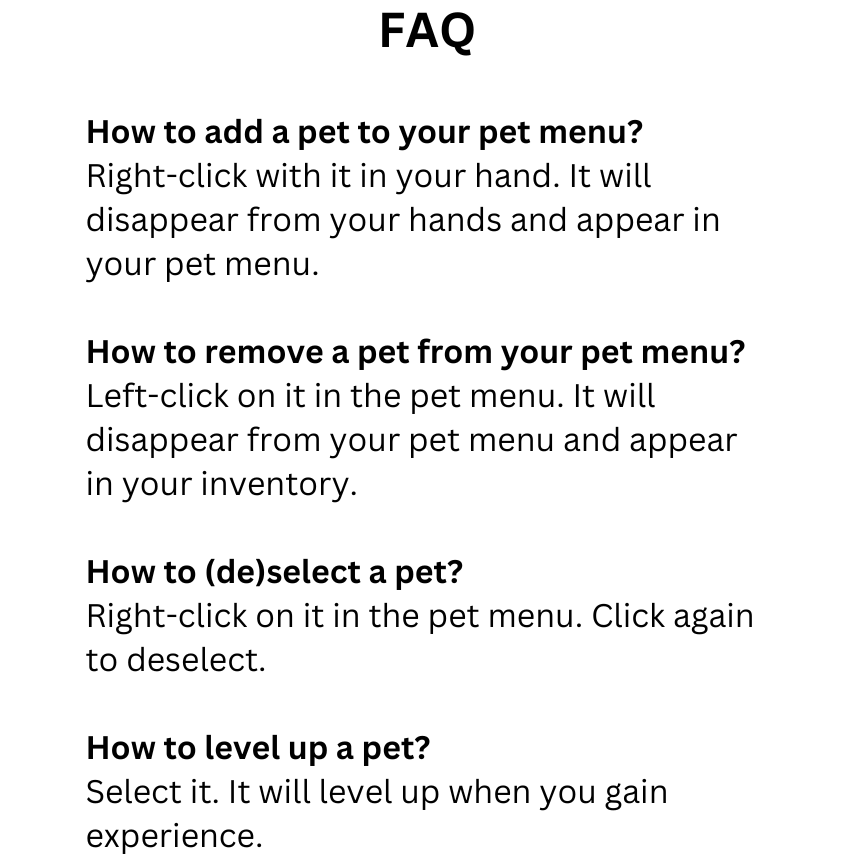

# Overview



[](https://www.spigotmc.org/resources/pets.106830/)
[](https://github.com/Aregcraft/pets)

# Configuration

Specify colors and placeholders with `%color_name%` or `%placeholder_name%` (e.g., `%dark_blue%`, `%level%`).

## position.json

Configures the pet position relative to the player.

### x: double

Specifies the x coordinate of the position.

### y: double

Specifies the y coordinate of the position.

### z: double

Specifies the z coordinate of the position.

```json
{
  "x": 1,
  "y": 2,
  "z": 1
}
```

## menu.json

Configures the pet menu.

### title: string

Specifies the title of the menu.

### size: int

Specifies the size of the menu (must be a multiple of 9).

```json
{
  "title": "Pets",
  "size": 36
}
```

## pets.json

Configures the pet types.

### id: string

Specifies the id of the pet.

### name: string

Specifies the name of the pet.

Colorized, placeholders:
- **player** - the name of the owner
- **level** - the level of the pet

### head: string

Specifies the url of the skin (see [https://minecraft-heads.com/](https://minecraft-heads.com/)).

### item

Specifies the item of this pet.

#### material: material

Specifies the material of the item (use `PLAYER_HEAD`).

#### name: string

Specifies the name of the item.

Colorized, placeholders:
- **level** - the level of the pet

#### lore: string list

Specifies the lore of the item.

Colorized, placeholders:
- **level** - the level of the pet
- **attackSpeed** - the attack speed provided by the pet
- **attackDamage** - the attack damage provided by the pet
- **maxHealth** - the max health provided by the pet
- **knockbackResistance** - the knockback resistance provided by the pet
- **movementSpeed** - the movement speed provided by the pet
- **armor** - the armor provided by the pet
- **armorToughness** - the armor toughness provided by the pet

### recipe

Specifies the crafting recipe of the pet.

#### shape: string list

Specifies the shape of the crafting recipe.

#### ingredients: char to material map

Specifies single-character aliases for the materials used in the shape.

### level: expression

Specifies the mathematical expression for calculating the pet level.

Arguments:
- **x** - the player experience

### [attribute]: expression

- **attackSpeed** - the attack speed provided by the pet
- **attackDamage** - the attack damage provided by the pet
- **maxHealth** - the max health provided by the pet
- **knockbackResistance** - the knockback resistance provided by the pet
- **movementSpeed** - the movement speed provided by the pet
- **armor** - the armor provided by the pet
- **armorToughness** - the armor toughness provided by the pet

Specifies the mathematical expression for calculating the stat boosts provided by the pet.

Arguments:
- **x** - the pet level

```json
[
  {
    "id": "LION",
    "name": "%green%[%level%] %player%'s Lion",
    "head": "6b3a8ce66dc3927bb5482b29e936b39d24589f91e997bb3dfd567396e871120",
    "item": {
      "material": "PLAYER_HEAD",
      "name": "%green%[%level%] Lion",
      "lore": [
        "%dark_gray%Roar...",
        "",
        "%gray%When selected:",
        "%dark_green% %maxHealth% Max Health",
        "%dark_green% %attackDamage% Attack Damage",
        "%dark_green% %armor% Armor"
      ]
    },
    "recipe": {
      "shape": [
        "ggg",
        "geg",
        "ggg"
      ],
      "ingredients": {
        "g": "GOLD_BLOCK",
        "e": "EGG"
      }
    },
    "level": "x / 50",
    "maxHealth": "x / 5",
    "attackDamage": "x / 10",
    "armor": "x / 10"
  },
  {
    "id": "ELEPHANT",
    "name": "%gray%[%level%] %player%'s Elephant",
    "head": "7071a76f669db5ed6d32b48bb2dba55d5317d7f45225cb3267ec435cfa514",
    "item": {
      "material": "PLAYER_HEAD",
      "name": "%gray%[%level%] Elephant",
      "lore": [
        "%dark_gray%Trumpet...",
        "",
        "%gray%When selected:",
        "%dark_green% %maxHealth% Max Health",
        "%dark_green% %armor% Armor",
        "%dark_green% %attackSpeed% Attack Speed"
      ]
    },
    "recipe": {
      "shape": [
        "odo",
        "ded",
        "odo"
      ],
      "ingredients": {
        "o": "OBSIDIAN",
        "d": "DIAMOND_BLOCK",
        "e": "EGG"
      }
    },
    "level": "x / 50",
    "maxHealth": "x / 5",
    "attackSpeed": "x / 10",
    "armor": "x / 5"
  }
]
```
