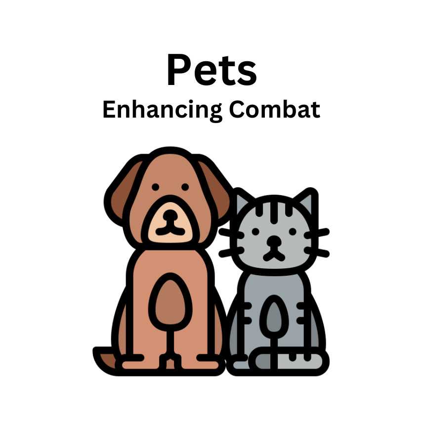
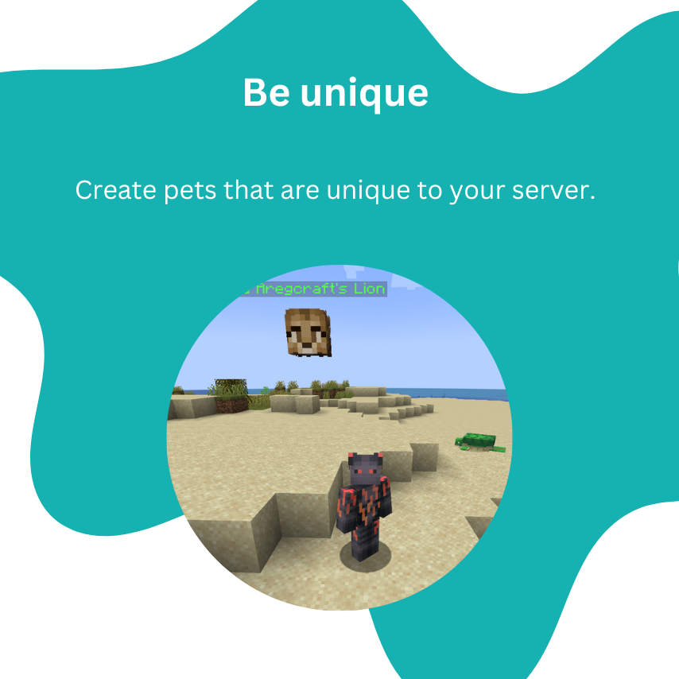
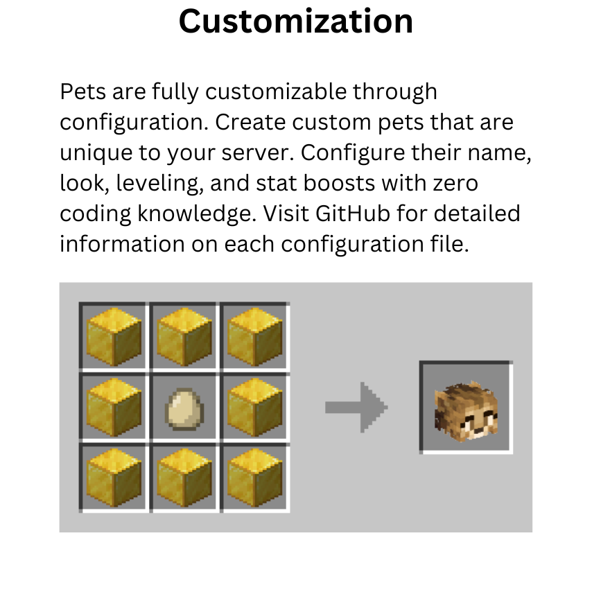
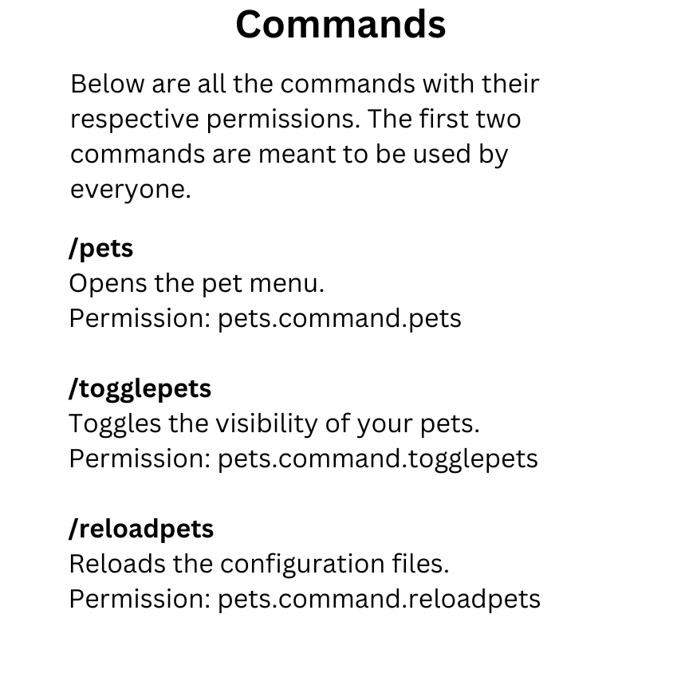

# Overview

[](https://www.spigotmc.org/resources/pets.106830/)
[](https://github.com/Aregcraft/pets)





# Configuration

Specify colors and placeholders with `%COLOR_NAME%` or `%PLACEHOLDER_NAME%` (e.g., `%DARK_BLUE%`, `%REFORGE_NAME%`).

## config.json

Configures the pets menu and pet position.

### petPosition

Specifies the pet position relative to the player.

#### x: double

Specifies the x coordinate of the position.

#### y: double

Specifies the y coordinate of the position.

#### z: double

Specifies the z coordinate of the position.

### menuTitle: string

Specifies the title of the pets menu.

### menuSize: int

Specifies the size of the pets menu (must be a multiple of 9).

```json
{
  "petPosition": {
    "x": 1,
    "y": 2,
    "z": 1
  },
  "menuTitle": "Pets",
  "menuSize": 36
}
```

## pet_items.json

Configures the pet items.

### id: string

Specifies the id of the pet.

### recipe

Specifies the crafting recipe of the pet.

#### result

Specifies the resulting item of the recipe.

##### name: string

Specifies the name of the item.

Colorized, no placeholders.

##### lore: string list

Specifies the lore of the item.

Colorized, no placeholders.

#### shape: string list

Specifies the shape of the crafting recipe.

#### ingredients: char to material map

Specifies single-character aliases for materials used in the shape.

```json
[
  {
    "id": "LION",
    "recipe": {
      "result": {
        "name": "%GREEN%Lion",
        "lore": [
          "%DARK_GRAY%Roar...",
          "",
          "%GRAY%When selected:",
          "%DARK_GREEN% 4 Max Health",
          "%DARK_GREEN% 2 Attack Damage",
          "%DARK_GREEN% 2 Armor"
        ]
      },
      "shape": [
        "ggg",
        "geg",
        "ggg"
      ],
      "ingredients": {
        "g": "GOLD_BLOCK",
        "e": "EGG"
      }
    }
  },
  {
    "id": "ELEPHANT",
    "recipe": {
      "result": {
        "name": "%GRAY%Elephant",
        "lore": [
          "%DARK_GRAY%Trumpet...",
          "",
          "%GRAY%When selected:",
          "%DARK_GREEN% 8 Max Health",
          "%DARK_GREEN% -1 Attack Damage",
          "%DARK_GREEN% 4 Armor"
        ]
      },
      "shape": [
        "odo",
        "ded",
        "odo"
      ],
      "ingredients": {
        "o": "OBSIDIAN",
        "d": "DIAMOND_BLOCK",
        "e": "EGG"
      }
    }
  }
]
```

## pets.json

Configures the pets.

### id: string

Specifies the id of the pet.

### name: string

Specifies the name of the pet.

Colorized, placeholders:
- **PLAYER** - the name of the player

### head

Specifies the head of the pet.

#### url: string

Specifies the url of the skin (see [https://minecraft-heads.com/](https://minecraft-heads.com/)).

### [attribute]: double

- **attackSpeed** - the attack speed provided by the pet
- **attackDamage** - the attack damage provided by the pet
- **maxHealth** - the max health provided by the pet
- **knockbackResistance** - the knockback resistance provided by the pet
- **movementSpeed** - the movement speed provided by the pet
- **armor** - the armor provided by the pet
- **armorToughness** - the armor toughness provided by the pet

```json
[
  {
    "id": "LION",
    "name": "%GREEN%%PLAYER%'s Lion",
    "head": {
      "url": "6b3a8ce66dc3927bb5482b29e936b39d24589f91e997bb3dfd567396e871120"
    },
    "maxHealth": 4,
    "attackDamage": 2,
    "armor": 2
  },
  {
    "id": "ELEPHANT",
    "name": "%GRAY%%PLAYER%'s Elephant",
    "head": {
      "url": "7071a76f669db5ed6d32b48bb2dba55d5317d7f45225cb3267ec435cfa514"
    },
    "maxHealth": 8,
    "attackDamage": -1,
    "armor": 4
  }
]
```
